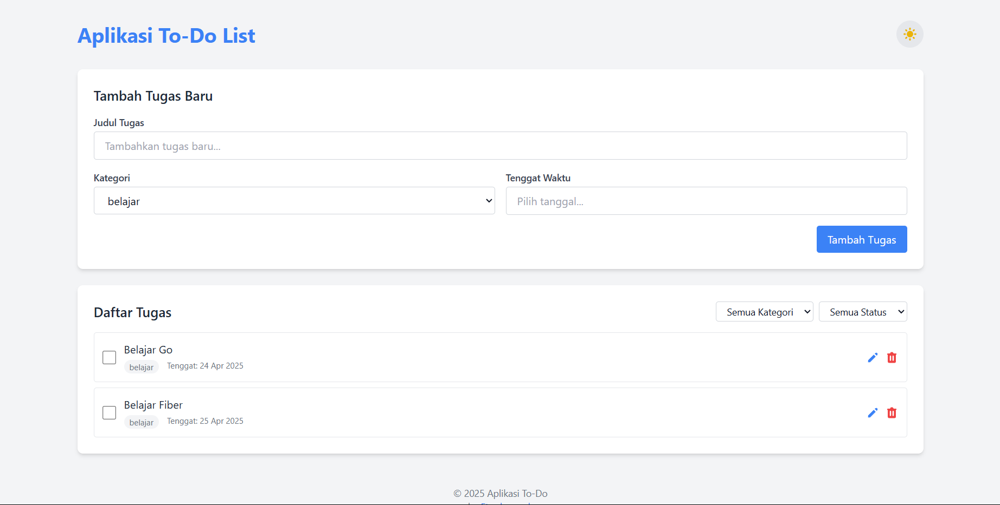

# 📝 Aplikasi To-Do List


Aplikasi manajemen tugas sederhana tetapi kuat yang dibangun menggunakan Go dengan framework Fiber dan Tailwind CSS untuk tampilan modern dan responsif.



## ✨ Fitur

- ✅ Menambahkan tugas baru dengan judul, kategori, dan tenggat waktu
- 🔄 Menandai tugas sebagai selesai
- 🗑️ Menghapus tugas
- 🌓 Mode Gelap/Terang otomatis dan manual
- 🔍 Filter tugas berdasarkan kategori dan status
- 📋 Mengelola kategori tugas
- 📱 Antarmuka responsif dengan Tailwind CSS
- 🚀 API REST lengkap untuk CRUD tugas

## 🛠️ Teknologi

- [Go](https://golang.org/) - Bahasa pemrograman yang cepat dan efisien
- [Fiber](https://gofiber.io/) - Framework web Go yang cepat, terinspirasi Express.js
- [Tailwind CSS](https://tailwindcss.com/) - Framework CSS utility-first untuk desain cepat
- [Flatpickr](https://flatpickr.js.org/) - Date picker JavaScript yang ringan
- [LocalStorage API](https://developer.mozilla.org/en-US/docs/Web/API/Window/localStorage) - Untuk menyimpan preferensi tema

## 📋 Persyaratan

- Go 1.21 atau lebih baru
- Web browser modern

## 🚀 Instalasi dan Menjalankan

1. Kloning repositori ini
   ```bash
   git clone https://github.com/FaturRahmanZaki/Golang-To-do-list
   cd to-do-list
   ```

2. Download dependensi
   ```bash
   go mod tidy
   ```

3. Jalankan aplikasi
   ```bash
   go run main.go
   ```

4. Buka aplikasi di browser
   ```
   http://localhost:3000
   ```

## 📁 Struktur Proyek

```
to-do-list/
├── main.go          # File utama aplikasi dengan server Fiber dan routing
├── public/          # Aset statis (CSS, JS, gambar)
├── views/           # Template HTML
│   └── index.html   # Halaman utama (dengan dukungan Dark Mode)
└── README.md        # Dokumentasi
```

## 📡 API Endpoints

| Endpoint             | Metode | Deskripsi                             |
|----------------------|--------|---------------------------------------|
| `/api/todos`         | GET    | Mendapatkan semua tugas               |
| `/api/todos`         | POST   | Membuat tugas baru                    |
| `/api/todos/:id`     | PUT    | Memperbarui tugas                     |
| `/api/todos/:id`     | DELETE | Menghapus tugas                       |
| `/api/categories`    | GET    | Mendapatkan semua kategori            |
| `/api/categories`    | POST   | Membuat kategori baru                 |

## 🤝 Kontribusi

Kontribusi selalu disambut! Buka issue atau ajukan pull request untuk meningkatkan aplikasi.

## 👤 Kreator

<a href="https://github.com/FaturRahmanZaki">
  
</a>

**Fatur Rahman Zaki**


- GitHub: [@FaturRahmanZaki](https://github.com/FaturRahmanZaki)
- Instagram: [@ftrrahmanzk](https://instagram.com/ftrrahmanzk)

## 📄 Lisensi

Proyek ini dilisensikan di bawah lisensi MIT - lihat file [LICENSE](LICENSE) untuk detail.

---
